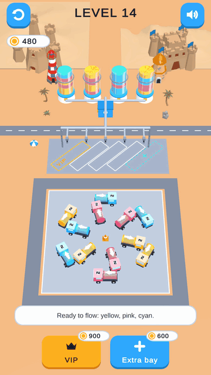

# Tanker Jam

A casual mobile puzzle game made in **Unity 6**. Tap tanker trucks to drive them out of a crowded lot, park them in the bays, and pump their colored fuel into the matching vessels. Choose your order carefully: if the bays fill up with the wrong colors, the lot jams.

  
  &nbsp;&nbsp;
  

## Play it

📱 **[Download the Android APK](https://drive.google.com/drive/folders/1n6I61XEIxBu-tHMRNTjTRX6AsGMFYrDp?usp=sharing)**

On your Android phone, open the link, download the APK from the Google Drive folder, and allow "Install unknown apps" when asked.

## Features

- 50 hand-tuned and generated levels with a rising difficulty curve
- Free-angle truck placement and shaped boards (not just a grid)
- Smooth truck driving, pumping, and liquid-filling animations
- Jam detection, with a VIP bay to rescue a stuck level
- Built-in level editor with symmetry and shape tracing
- Level solver that checks every level can be won and scores its difficulty

## Built with

- Unity 6 (6000.6.2f1), Universal Render Pipeline (URP)
- C#, with the game rules kept in a pure C# core separate from the visuals
- DOTween for UI and feedback animations
- Unity Test Framework for EditMode and PlayMode tests

## Project layout

| Folder | What's in it |
| --- | --- |
| `Assets/_TankerJam/Scripts/Core` | Game rules, level format, solver (no Unity dependencies) |
| `Assets/_TankerJam/Scripts/Game` | Trucks, vessels, camera, input, audio, effects |
| `Assets/_TankerJam/Scripts/UI` | Menus and in-game screens |
| `Assets/_TankerJam/Data/Levels` | Level files (JSON) |
| `Assets/_TankerJam/Tests` | Automated tests |
| `Tools/levelgen` | Original Python level generator (kept for reference) |

## Run it yourself

1. Clone this repo.
2. Open the folder in Unity Hub with Unity **6000.6.2f1**.
3. Open `Assets/_TankerJam/Scenes/Game.unity` and press Play.

## Author

Made by **Awais Naseer**, developed with [Claude](https://claude.com/claude-code) by Anthropic.
